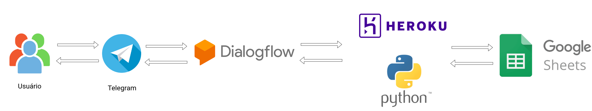

# Ramon
Chatbot para redes sociais

    

O objetivo do chatbot é verificar informações do produto na base de dados e retornar a resposta ao usuário.

Equipe 

- Júlia Maria Cardoso Lima da Silva Reis
- Anderson de Alencar Barros
- Richard Lima Ribeiro
